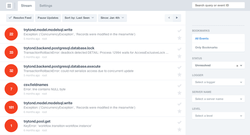

Monitoring Tryton
=================

It is important to monitor application to ensure that the application
works for everyone and to monitor the server. Sentry is the preferred tool
for monitoring the whole application.

Watching for Errors
-------------------

All exceptiosn are automatically captured from both Tryton daemon and then
collected in sentry. Sentry keeps records of the stack traces and a
sanitized context(values of variables) and client information making
debugging a zephyr.

Instrumentation
---------------

Instrumenting and monitoring requests
